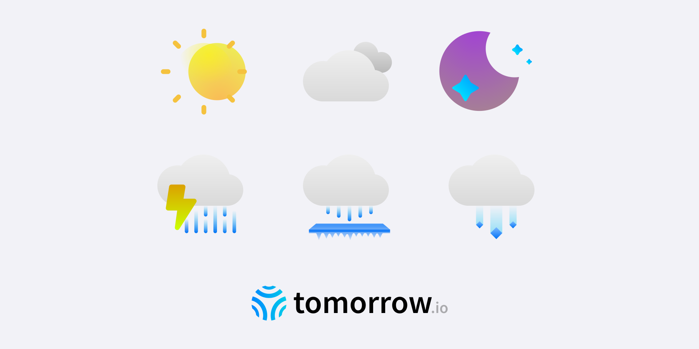

Weather Code Icons
========

#### Icons for Tomorrow.io API ####
Is it foggy? Rainy? A clear day? If you need a description of what the weather is like, simply request the weather code. As our beloved [Tomorrow.io API](https://docs.tomorrow.io/reference/data-layers-core) consumers, we provide full access to our library of weather icons. 

### What's Included ###
**Weather Codes V2** - PNG and PDF colored icons, of all new weather conditions including V1 weather conditions and additional V2 mixed weather conditions, can be found in [V2 icons folder](./V2_icons). 

Weather Codes V1 - SVG icons, colored and black, of all available weather codes: `freezing_rain_heavy`, `freezing_rain`, `freezing_rain_light`, `freezing_drizzle`, `ice_pellets_heavy`, `ice_pellets`, `ice_pellets_light`, `snow_heavy`, `snow`, `snow_light`, `flurries`, `tstorm`, `rain_heavy`, `rain`, `rain_light`, `drizzle`, `fog_light`, `fog`, `cloudy`, `mostly_cloudy`, `partly_cloudy`, `mostly_clear`, `clear`

### Usage ###
Figam - Open source Figma canvas.

PNG - Several size options.

PDF - Vector icons.

Be sure to place a “Powered by Tomorrow.io attribution in your application if you use our icons.

### Contributors ###
This project exists thanks to our very own designers - Elad Rahmin ([@EladRahmin](https://twitter.com/EladRahmin)) and Vera Mordehayev ([@veramordehayev
](https://twitter.com/veramordehayev))

### License ###
Licensed under the [CC BY 4.0 License](./LICENSE).
